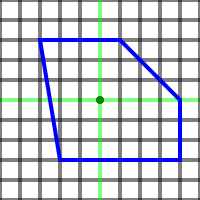
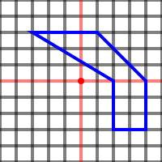

# svg-morphing

svg-morphing helps in resolving the path length issue when animating svg from one shape to another by adjusting the paths command lines.

## Why
Animating from
```html
<!-- heart -->
<path d="M 10,30 A 20,20 0 0 1 50 30 A 20,20 0 0 1 90 30 Q 90,60 50 90 Q 10 60 10 30 z" />
```
to
```html
<!-- circle -->
<path d="M 80 50 A 30,30 0 0 1 20 50 A 30,30 0 0 1 80 50" />
```
will make the path "jumps" from first shape to second.

However, animating from
```html
<!-- same heart as before - path d attribute once adapted -->
<path d="M 10 30 C 10 36.72 11.5 43.44 14.51 50.16 C 20.46 63.44 32.29 76.72 50 90 C 67.7 76.72 79.53 63.44 85.48 50.16 C 88.49 43.44 89.99 36.72 89.99 30 C 90 18.95 81.05 9.99 70 9.99 C 58.95 9.99 50 18.94 50 29.99 C 50 18.96 41.03 10 29.99 10 C 18.96 10 10 18.96 10 30" />
```
to
```html
<!-- same circle as before - path d attribute once adapated -->
<path d="M 23.12 36.67 C 21.12 40.69 20 45.21 20 50 C 20 66.55 33.44 80 50 80 C 66.55 80 80 66.55 80 50 C 80 45.21 78.88 40.69 76.88 36.67 C 73.96 30.8 69.18 26.03 63.31 23.11 C 59.29 21.12 54.77 20 49.99 20 C 45.21 20 40.69 21.12 36.68 23.11 C 30.81 26.03 26.04 30.8 23.12 36.67" />
```
will make the path smoothly transitions from first shape to second.

svg-morphing returns these adapted paths.

___


## Installation Process
1. Install svg-morphing by running ``` npm install ``` in the *svg-morphing* folder.
2. Install webpack build process by running ``` npm install ``` in the *root* folder.
3. Replace svg paths in *src/index.html* with yours, following *Usage* instructions as below.
4. Run ``` npm run build ``` in the *root* folder.
5. Get the results in the build (*dist/index.html* file).


## Usage

To morph svg from #path0 to #path1, define desired paths as usual in svg \<defs> element.

### Attributes
Add 2 attributes to both paths:
  * svg-adapt: tells svg-morphing that this path must be transformed.
  * svg-adapt-[name]: tells svg-morphing which group this path belongs to. There must be 2 paths with identical svg-adapt-[name] attribute to proceed. No more, no less.

### Class
Set the class of the svg \<animate> element\(s) to the svg-adapt-[name] you picked.

### Limitations
Both svg paths must be drawn around SVG viewBox center point as illustrated below (paths drawn in blue).

This one will work.



This one will not (maybe someday).



```html
<svg viewBox="0 0 100 100">
  <defs>
    <path id="path0" svg-adapt svg-adapt-a d="M 10,30 A 20,20 0 0 1 50 30 A 20,20 0 0 1 90 30 Q 90,60 50 90 Q 10 60 10 30 z" />
    <path id="path1" svg-adapt svg-adapt-a d="M 80 50 A 30,30 0 0 1 20 50 A 30,30 0 0 1 80 50" />
  </defs>
  <path>
    <animate class="svg-adapt-a"
      attributeName="d"
      dur="1.5s"
      fill="freeze" />
  </path>
</svg>
```


## How it works
The current repo is set to preprocess the .html file at build time.
Paths sent to the client therefore already fit the conditions to smoothly morph and do not need to be computed by the browser.


## Forwards
* Adapt svg-morphing to morph polygon points.
* Tackle SPA framework integration


## Demo
Build result available on https://codepen.io/sipann/pen/YzzraLg


## Dependencies
- svg-arc-to-cubic-bezier
